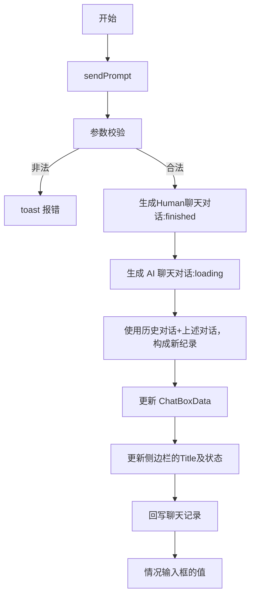

# Chat status

## Chat record

在 `ChatRecordContext` 中提供。

其中状态有三个：
- loading
- running
- finish

| 状态 | 作用 |
| --- | --- |
| `loading` | 加载中，此时 AI 聊天的头像右侧展示 loading 的效果 |
| `running` | 运行中 |
| `finish` |  |

这些状态变化封装在 `useChatGenerate` 中。

## isChatting

最后一条记录存在，且不为 finish，则视为聊天中。

在 `ChatBoxContext` 中提供。

## 流程

